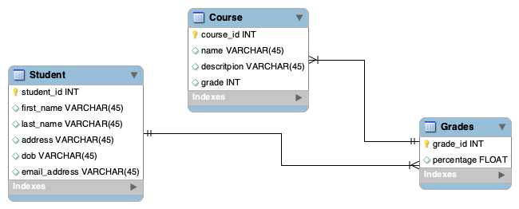

# Student-Management-List
DevOps Core Fundamental Project 

This is an Individual project that stores a list of students. It is a CRUD application which utilies supporting tools, methodologies and technologies that encapsulates all core moldues covered during my training. 
A Student Management Application where students can view, delete, and update theit details.

# Requirements
* A Trello board is being used to fully expand the user stories, use cases and tasks needed to complete this project. Link to Trello board[https://trello.com/b/A2vy4TCG]
* I used github as my version control
* A functional CRUD application created in Python
* A relational database with at least 2 tables
* Automated test for validation
* Integrated API's using Flask
* Built Through CI server

# App Design
This Student Managment App allows Users to create, read, update delete their course, and details. Students are also able view their grades for each course. This is done with 3 tables Student,Grades and Course.

# Risk Assessment

Software risk management is a balance of risk and reward, therefore it is essential that—as the team reviews the requirements (user stories in the product backlog)—it must also evaluate the risk for each one. In software, a high risk often does not correspond with a high reward. Instead, the driving question for managing risk should be: Does the potential reward for each story or requirement warrant the level of risk that the team is assuming as it proceeds with development? By considering alternatives, a development team can often achieve (nearly) the same level of reward without nearly as much risk. Adoption of this posture will help improve requirements prioritization.

# Version Control
I used Git for Version Control and hosted the project repository on Github. When I as done, I committed that as a "main" branch. And I created a "dev" branch where I did all my coding.

# Future Work
* I would like to add login ability for students and lecturers.
* I would like to add funcationaly on lectures can delete student files.

# Executing program
* export FLASK_APP=app.py
* flask run

